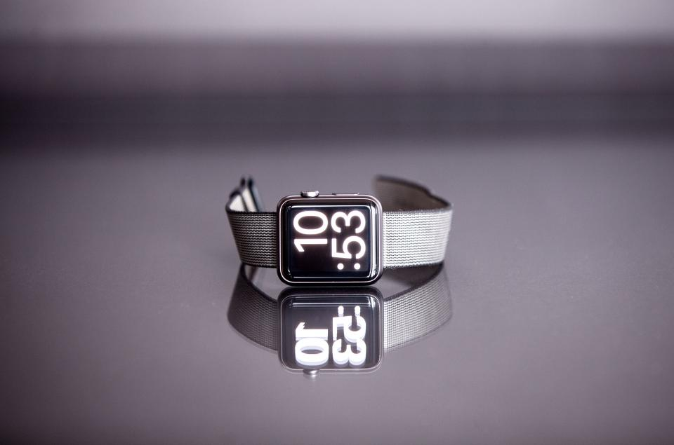
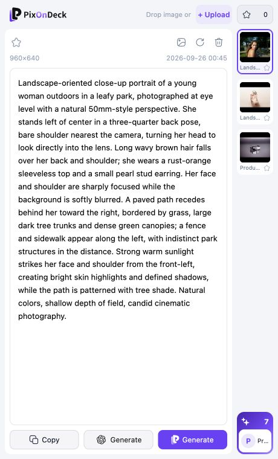
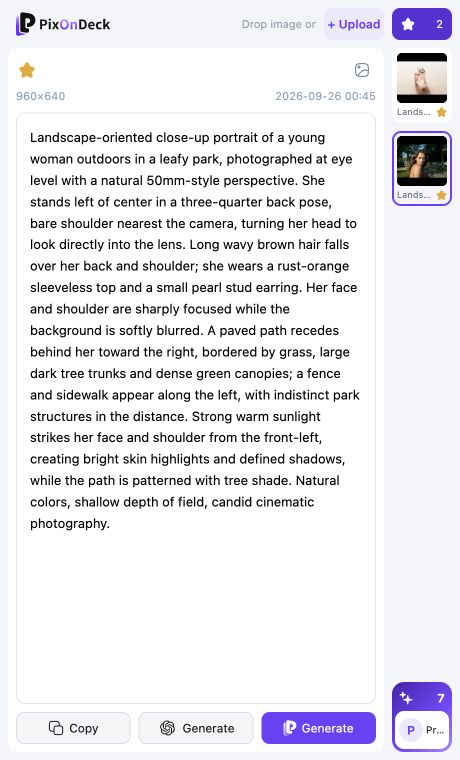
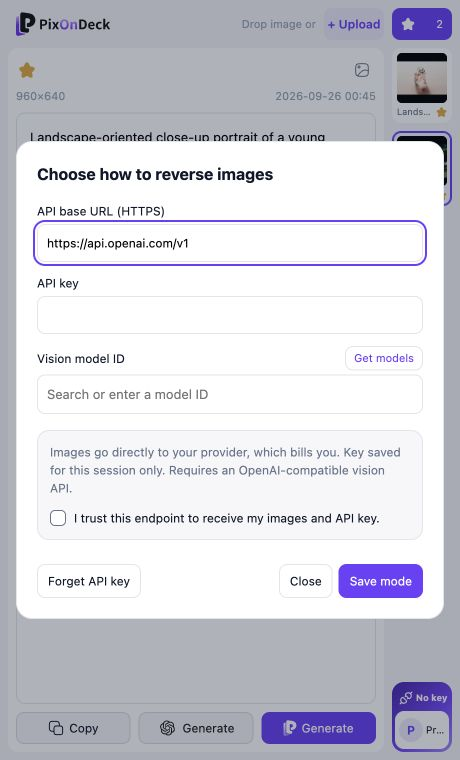
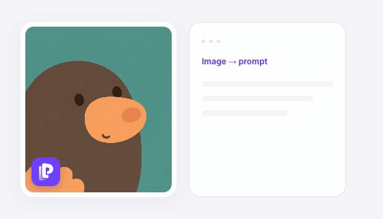

<div align="center">


# PixOnDeck — 图片反推提示词

**把浏览网页时发现的图片，转成可编辑的 AI 提示词。**

[English](README.md) · **简体中文**

[](https://github.com/CharlexH/pixondeck-extension/releases/download/v1.0.1/pixondeck-chrome-1.0.1-manual-install.zip)
[](#chrome-商店)
[](https://pixondeck.com/extension?utm_source=github&utm_medium=referral&utm_campaign=extension_open_source&utm_content=readme_zh_website)

选取图片 → 反推提示词 → 一键带到 **ChatGPT 或 PixOnDeck** 生成。

</div>

> **目前请使用手动安装。** Chrome 商店版本尚未上架。下载上方已打包的 ZIP 即可，不需要 Node.js、终端或自行编译。

[安装步骤](#手动安装) · [第一次反推](#开始第一次反推) · [更新与排错](#更新与常见问题) · [隐私说明](#隐私与权限) · [开发者说明](#开发者说明)

## 图片反推示例

人像、美妆产品、电商摄影：用真实图库照片展示实际反推结果。[查看完整提示词与图片来源](docs/examples/README.md)。

<table>
  <tr>
    <td width="33%" valign="top"><strong>人像写真</strong><br><br><a href="docs/examples/README.md"></a></td>
    <td width="33%" valign="top"><strong>香水产品</strong><br><br><a href="docs/examples/README.md"></a></td>
    <td width="33%" valign="top"><strong>手表电商图</strong><br><br><a href="docs/examples/README.md"></a></td>
  </tr>
</table>

## 产品界面

实际客户端界面，回放上述图片的反推结果；账号和收藏使用本地演示状态。点击图片可放大。

<table>
  <tr>
    <td width="33%" valign="top"><strong>编辑反推提示词</strong><br><br><a href="docs/screenshots/workspace.png"></a></td>
    <td width="33%" valign="top"><strong>提示词收藏</strong><br><br><a href="docs/screenshots/saved-prompts.png"></a></td>
    <td width="33%" valign="top"><strong>BYOK</strong><br><br><a href="docs/screenshots/byok-settings.png"></a></td>
  </tr>
</table>

[](src/assets/welcome-demo.mp4)

*操作演示动图 · 点击查看 MP4。*

## 手动安装

需要桌面版 **Chrome 116 或更新版本**。公司或学校管理的浏览器可能限制开发者模式。

1. **[下载手动安装 ZIP](https://github.com/CharlexH/pixondeck-extension/releases/download/v1.0.1/pixondeck-chrome-1.0.1-manual-install.zip)。** 选择 `pixondeck-chrome-1.0.1-manual-install.zip`，不要选择 GitHub 自动提供的 **Source code** 源码包。
2. **解压到固定文件夹**，例如 `文稿/PixOnDeck-extension`。安装后保留这个文件夹，不要删除或随意移动。
3. **打开扩展管理页**：在 Chrome 地址栏粘贴 `chrome://extensions` 并回车。
4. **开启右上角的「开发者模式」**。
5. **点击「加载已解压的扩展程序」**，选择直接包含 `manifest.json` 的解压文件夹。
6. **固定并打开插件**：点击浏览器工具栏的拼图图标，固定 PixOnDeck，再点击它打开侧边栏。

你选择的文件夹应类似这样：

```text
PixOnDeck-extension/
├── manifest.json    ← 选择这一层文件夹
├── panel.html
├── panel.js
├── background.js
└── ...
```

**安装检查：** 扩展 ID 应为 `abghgbjbefmiakmklkkoabgbeengkkgd`。安装包已包含官方扩展公钥身份和服务配置。如果 ID 不一致，请确认下载的是手动安装包，且没有修改 `manifest.json`。

操作方式参考 [Chrome 官方手动加载说明](https://developer.chrome.com/docs/extensions/get-started/tutorial/hello-world?hl=zh-cn#load-unpacked)。

## 开始第一次反推

1. 打开 PixOnDeck 侧边栏并**登录账号**。目前积分模式和 BYOK 都需要登录。
2. **上传图片**，或在普通网页使用图片入口、右键菜单选取图片。安装前已打开的网页需要先刷新。
3. 在账号菜单里**选择处理模式**，然后开始反推。
4. **编辑结果**，收藏提示词，或点击 **Generate**，一键带到 **ChatGPT 或 PixOnDeck** 继续生成。在目标页面确认生成即可；超长 ChatGPT 提示词会复制到剪贴板，供粘贴使用。

| 模式 | 需要准备 | 费用 |
| --- | --- | --- |
| **PixOnDeck 积分** | 有可用积分的 PixOnDeck 账号 | 消耗 PixOnDeck 积分 |
| **自带 API Key（BYOK）** | 可信的 HTTPS 服务地址、Key、兼容 OpenAI 接口的视觉模型 | 由供应商计费 |

BYOK 在账号菜单里配置。反推结果是 AI 对图片的理解，不能保证找回原作者的提示词。官网图片生成是另外的主动操作。

## 可以做什么

| 功能 | 用途 |
| --- | --- |
| 网页取图 | 看到参考图片就能开始反推 |
| 一键去 ChatGPT / PixOnDeck 生成 | 带着编辑后的提示词和图片比例，直接继续创作 |
| 可编辑提示词 | 按自己的创作需求调整结果 |
| BYOK | 使用自己选择的兼容视觉模型供应商 |
| 最近任务与提示词收藏 | 回看近期结果，保留有用的提示词 |
| 客户端开源 | 查看图片处理、权限与请求逻辑 |

## Chrome 商店

**尚未公开上架，敬请期待。** 顶部商店按钮目前指向此说明，上架后会替换为正式商店链接。现在请使用手动安装包，也可到[官网插件页](https://pixondeck.com/extension?utm_source=github&utm_medium=referral&utm_campaign=extension_open_source&utm_content=zh_store_status)查看产品动态。

## 更新与常见问题

手动安装版本**不会自动更新**。以后从 [Releases](https://github.com/CharlexH/pixondeck-extension/releases) 下载新的手动安装 ZIP，解压后替换原安装文件夹中的内容，再到 `chrome://extensions` 点击插件卡片上的**重新加载**，并刷新使用图片入口的网页。更新时尽量不要先卸载，卸载可能清除本地数据。重新加载也会清除会话中保存的 BYOK Key，需要时请重新填写。

| 问题 | 处理方法 |
| --- | --- |
| 提示找不到或无法读取清单文件 | 先解压 ZIP，选择直接包含 `manifest.json` 的文件夹 |
| 网页图片上没有入口 | 刷新网页、检查 Chrome 的网站访问权限，或改用本地上传 |
| Chrome 内部页面、商店、Canvas 或 CSS 背景图 | 这些位置不支持直接取图，请改用本地上传 |
| 官网已登录，侧边栏仍未登录 | 完成官网登录后关闭再打开侧边栏，并核对上方扩展 ID |
| BYOK 请求失败 | 检查地址、Key、模型是否支持图片输入及供应商余额 |
| 找不到开发者模式 | 浏览器可能受公司或学校的管理策略限制 |

仍有问题？通过 [Issues](https://github.com/CharlexH/pixondeck-extension/issues) 提交可复现步骤，请勿上传密钥、令牌或私人图片。账号与账单问题联系 [hello@pixondeck.com](mailto:hello@pixondeck.com)。

## 隐私与权限

- 只提交你选取的图片，反推前在本地缩至最长边不超过 **480 像素**。
- 积分模式发送到 PixOnDeck 及其处理服务；BYOK 直接发送到你配置的供应商。
- BYOK Key 保存在可信的**扩展会话存储**中，不写入持久设置，也不发送给 PixOnDeck。
- 主动云收藏时，提示词与缩略图会保存到 PixOnDeck 账号。
- 网页权限用于取图，Cookie 用于共享登录，存储用于设置和历史。客户端未实现浏览历史采集。

详见[数据流与权限](docs/privacy.md)和[官网隐私政策](https://pixondeck.com/zh-CN/privacy)。AI 处理需要联网，可能消耗积分或产生供应商费用。

## 开发者说明

<details>
<summary><strong>自行构建或运行模拟预览</strong></summary>

需要 Node.js 22.18+。普通用户直接使用上方已打包的 ZIP 即可。

```sh
git clone https://github.com/CharlexH/pixondeck-extension.git
cd pixondeck-extension
npm ci
cp .env.example .env
npm run typecheck
npm test
npm run build
```

在 `chrome://extensions` 加载 `dist/`。与官方手动安装包不同，默认源码构建会生成本地开发身份，且没有正式登录配置。构建成功不代表已获准访问生产服务。[完整开发说明](docs/development.md)。

运行 `npm run preview`，打开 `http://127.0.0.1:8791` 可查看模拟数据界面。仅使用假 Key。

</details>

[贡献指南](CONTRIBUTING.md) · [路线图](docs/roadmap.md) · [安全反馈](SECURITY.md)

## 支持与许可

如果 PixOnDeck 对你有用，欢迎 **Star**，帮助更多人发现它。

原创代码与文档采用 [Apache-2.0](LICENSE)，保留 [NOTICE](NOTICE)；第三方依赖使用[各自的许可证](THIRD_PARTY_NOTICES.txt)，视觉素材范围见 [BRANDING.md](BRANDING.md)。官网后端与计费服务不在开源范围内。
