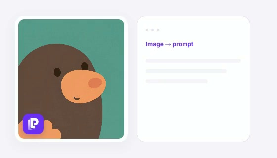

# PixOnDeck — 图片反推提示词

开源 Chrome 插件：选取网页图片，将它转成可编辑的 AI 提示词。支持 PixOnDeck 积分和自带 API Key（BYOK）。

**[获取 Chrome 插件](https://pixondeck.com/extension?utm_source=github&utm_medium=referral&utm_campaign=extension_open_source&utm_content=readme_zh_install)** · [访问 PixOnDeck](https://pixondeck.com/zh-CN?utm_source=github&utm_medium=referral&utm_campaign=extension_open_source&utm_content=readme_zh_website) · [English](README.md)



[查看简短动画](src/assets/welcome-demo.mp4)。这是交互示意，不是模型效果实测录像。

## 可以做什么

- 从网页图片上的入口、右键菜单或本地上传开始反推。
- 编辑和复制生成的提示词，使用可用的收藏及生成入口。
- 使用 PixOnDeck 积分，或连接兼容 OpenAI 接口的视觉模型供应商。
- 查看近期本地任务，将有用的提示词保存到 PixOnDeck 账号。
- 查看图片处理、浏览器权限和 BYOK 请求代码。

反推得到的是 AI 对图片的理解，不能保证找回原作者的提示词。

## 开始使用

1. 到[官网插件页](https://pixondeck.com/extension?utm_source=github&utm_medium=referral&utm_campaign=extension_open_source&utm_content=zh_get_started)查看当前安装方式。
2. 登录 PixOnDeck；目前积分模式和 BYOK 都需要账号。
3. 选择图片和处理模式，提交后编辑结果。

积分模式使用 PixOnDeck 积分；BYOK 由你选择的供应商计费。开源不等于免费或无限调用模型。官网生成是另外的主动操作。仓库源码可能领先商店版本，具体可用性以官方安装入口为准。

## 隐私与权限

仅在选取图片后提交分析，反推前将图片缩至最长边不超过 480 像素。BYOK Key 保存在扩展的会话存储中，只发送给配置的供应商，不发送给 PixOnDeck。选择云收藏时，提示词和缩略图会发送到 PixOnDeck。

插件需要网页图片访问、登录 Cookie、存储、侧边栏及右键菜单权限。客户端未实现浏览历史采集，也不是完全离线工具。详见[数据流与权限](docs/privacy.md)和[官网隐私政策](https://pixondeck.com/zh-CN/privacy)。

## 开发与预览

需要 Node.js 22.18+、Chrome 116+。

```sh
npm ci
cp .env.example .env
npm run typecheck
npm test
npm run build
```

在 `chrome://extensions` 开启开发者模式并加载 `dist/`。首次构建自动生成本地开发公钥身份。

**能独立构建，不代表已配置登录和后端。** 真实调用需要匹配的 Clerk、API 和精确的扩展来源白名单；此仓库不包含服务端，也不为任意扩展身份开放生产服务。[完整开发说明](docs/development.md)。

运行 `npm run preview` 后打开 `http://127.0.0.1:8791` 可查看使用模拟数据的界面。仅使用假 Key，不会实际验证模型能力。

## 支持项目

如果它对你有用，欢迎 Star，帮助更多人发现 PixOnDeck。问题反馈请使用 [Issues](https://github.com/CharlexH/pixondeck-extension/issues)，不要上传密钥、令牌或私人图片。账号及账单问题请联系 hello@pixondeck.com。

原创代码与文档采用 [Apache-2.0](LICENSE)，保留 [NOTICE](NOTICE) 来源说明；第三方依赖沿用各自许可证。品牌和媒体范围见 [BRANDING.md](BRANDING.md)。官网后端、计费和云服务不在开源范围内。
